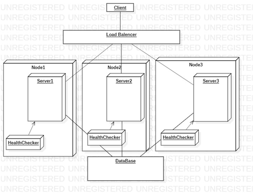
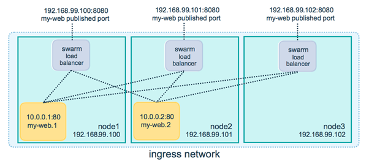
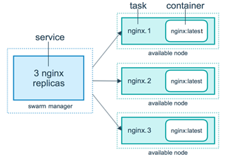
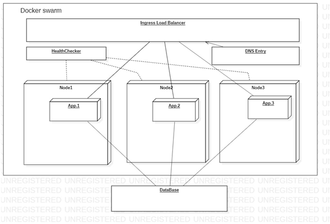

# 부하 분산 환경 구축 프로젝트

## 프로젝트 소개

스프링으로 구현된 웹 애플리케이션과 이 애플리케이션을 docker로 가상화, 배치를 통해 부하 분산을 구현, 안정적인 분산 서버를 구축했다.

서버를 분산시킴으로써 하나의 서버가 다운되더라도 사용자는 다른 서버를 통해 웹 서비스를 지속적으로 이용가능하도록 하는 것이 프로젝트의 목표다.

서버 역할을 하는 docker 컨테이너가 중단이 된다면, docker에서 상태 관리를 하기 때문에 중단된 컨테이너를 재실행하여 일정 개수의 컨테이너를 유지할 수 있게 해준다.

## 사용한 기술, 오픈 소스

1) Spring framework
2) postgreSQL
3) docker

## Docker

한 대의 서버로 모든 요청을 처리한다면 서버가 갖는 부하가 커진다. 이런 경우 서버가 안정적이지 못하고 다운될 위험이 크다.

이런 문제를 해결하는 방법으로 scale-up과 scale-out 2가지가 있는데 이중 scale-out을 하기로 했다.

분산 환경을 구축하기 위해서는 클라이언트의 요청을 복수의 서버 중 사용 가능한 서버에 연결해주기 위한 load balancer가 필요하다.

또 복제된 서버가 오류로 인해 중단되거나 많은 요청으로 인해 부하가 걸려 다운될 경우 재시작을 위한 HealthChecker도 필요하다.

프로젝트 구현하는데 필요한 대부분의 기능을 제공해주는 기술로 docker가 있어 docker를 사용했다.

그리고 docker 컨테이너를 원활하게 관리하기 위한 툴로 docker에서 기본적으로 제공하는 기능인 docker swarm을 사용하기로 했다.

docker swarm에서 부하 분산은 아래의 그림처럼 동작한다.

docker swarm에서 사용 가능한 서비스를 찾아가는 방식은 dns를 기반으로 찾아간다. 이 때 dns는 요청을 처리할 서비스의 이름이다.

도커 매니저가 앞서 task를 생성할 때 위의 그림처럼 각 노드에 컨테이너를 생성하고 task에 이름을 붙인다. 이 이름들은 도커 스웜에서 매니저 노드가 내부적으로 관리하는 DNS entry에 들어가게 된다.

그리고 요청이 들어올 때마다 dns entry에서 적절한 서비스의 이름을 반환해주면 로드 밸런서에서 해당 요청을 서비스의 이름과 일치하는 컨테이너에 전달한다.

## Docker swarm 구상도

